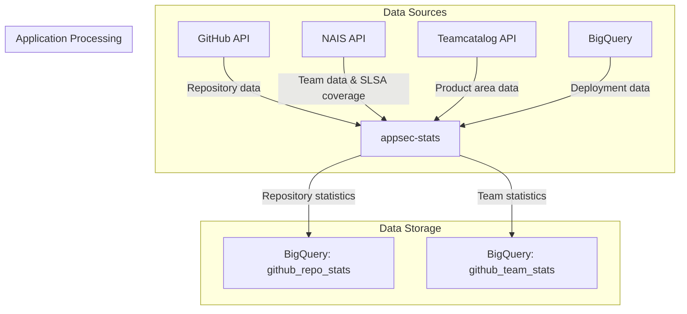
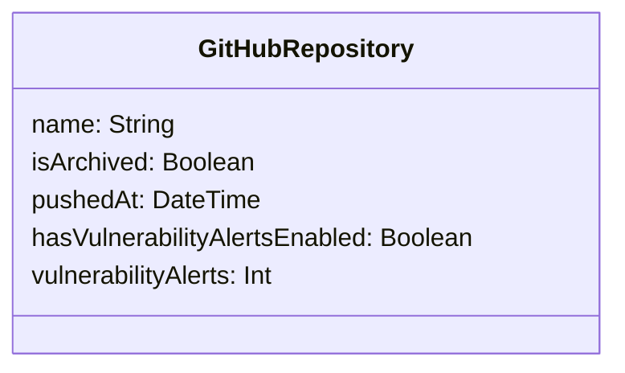
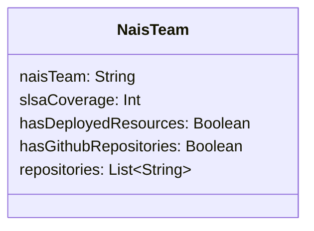
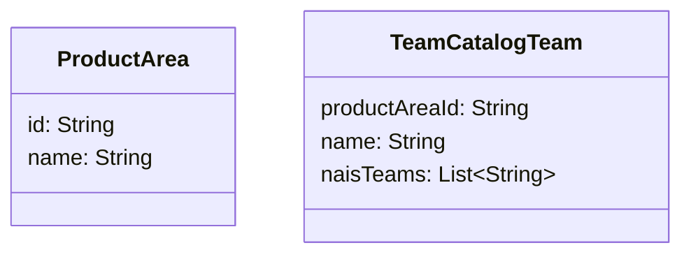
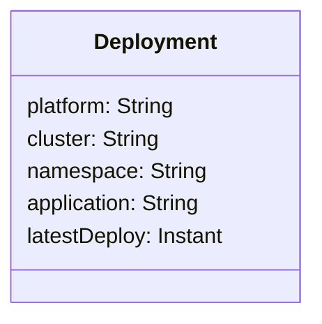
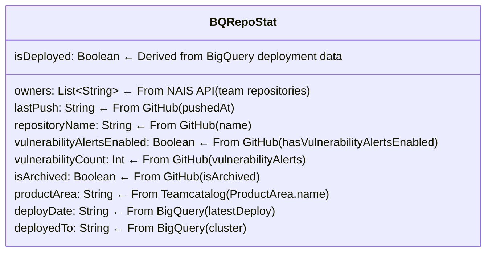
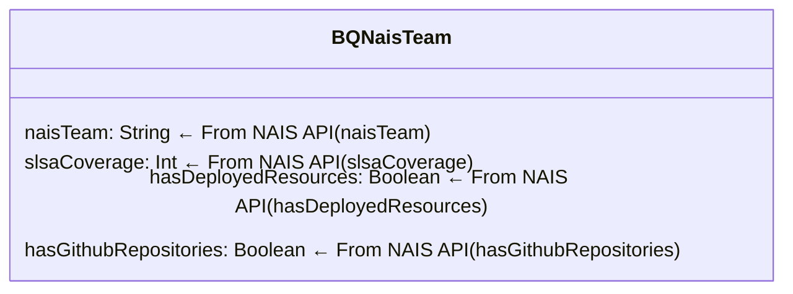

# Data Flow Documentation

## Overview Diagram

## Data Field Mapping

This document shows the exact fields collected from each data source and how they map to our final data models.

### Source: GitHub API

### Source: NAIS API

### Source: Teamcatalog API

### Source: BigQuery (Existing Data)

### Target Model: Repository Statistics

### Target Model: Team Statistics

## Data Processing Flow

1. **Collection Phase**:
   - Fetch repository data from GitHub GraphQL API
   - Fetch team data from NAIS API
   - Identify repository owners by matching repositories to teams

2. **Enrichment Phase**:
   - Query Teamcatalog to get product area information for teams
   - Fetch deployment data from BigQuery
   - Match deployments to repositories based on application name

3. **Transformation Phase**:
   - Convert GitHub repositories to `BQRepoStat` objects
   - Add team ownership information to repositories
   - Add product area information to repositories with owners
   - Add deployment information to repositories that have been deployed
   - Convert NAIS teams to `BQNaisTeam` objects

4. **Storage Phase**:
   - Insert `BQRepoStat` objects into BigQuery `github_repo_stats` table
   - Insert `BQNaisTeam` objects into BigQuery `github_team_stats` table
